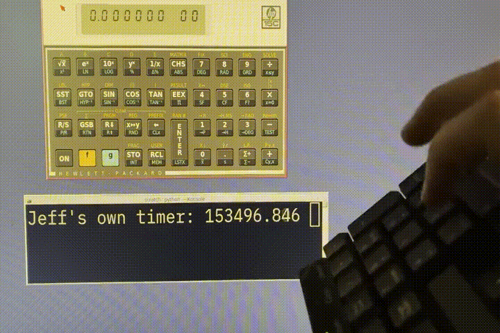
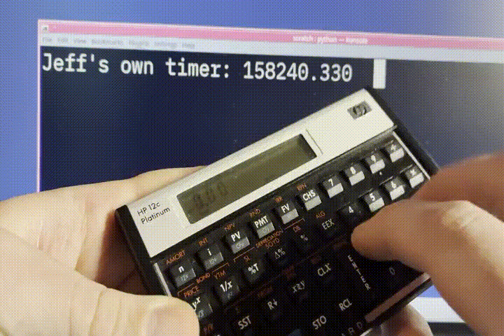

Jeff's Own HP-15C Simulator
---------------------------

This is a fork of the `HP-15C <https://hp-15c-simulator.de/>`_ to fix one single
bug, that **keyboard input is lost** with casual keyboard use. 

The Bug
=======

In this Video, numbers '3' and '1' are typed in succession, but, the number '1' keeps getting discarded!

If you are not careful to type slow enough, keystrokes are discarded and lost by `HP-15C <https://hp-15c-simulator.de/>`_!

From Torsten's `FAQ <https://hp-15c-simulator.de/FAQ>`_:

   > If I rapidly type a sequence of numbers, the entered keyboard number(s) are ignored. For example, if I type 123 quickly, the 2 is missed and I get 13 on the display.

   > While a key on the computer keyboard is being pressed, all other key presses are ignored. When you pressed the 2️⃣, you were still holding down the 1️⃣. This is exactly how the real HP-15C behaves.

I reached out to Torsten Manz by e-mail to explain the bug and fix in detail,
but, he strongly suggests that although he gets several requests to fix it, that
it is working as designed, and it is not a priority to be fixed.

The Fix
=======

With the bugfix applied to HP-15.tcl in this repository, numbers 3 and 1 are typed
very rapidly without loss, displayed in this video:

This repository is a full copy of the source code, Version 5.0.01, with the
patch applied for your convenience. You may also attempt to apply the patch file
`bugfix-HP-15C-keystrokes-lost.patch <bugfix-HP-15C-keystrokes-lost.patch>`_ to
any later version.

A Feature, really?
==================

Torsten Manz strongly suggests his software is accurately simulating the behavior
of the real HP-15C calculator by dropping keystrokes if typed "too quickly" as
described in his FAQ and in private response to my e-mail below.

On an HP-12C I can slowly press down '1', and while still holding it down,
press and hold down '2'. Then, release '1' and '2' in that order. This
"galloping" motion can be performed at speeds approximately three to five
times faster on a real calculator than what Torsten's software allows:

Installing
==========

No binary distributions are released, run the source directly, for example::

    tclsh HP-15.tcl

<<<<<<< HEAD

Details of Bugfix
=================

With bugfix applied, keystrokes are not lost. This is a video of numbers 3 and 1 are typed very rapidly, in succession, without loss:

The fix is described below,

::

     Date: Sun, 17 Aug 2025 16:29:44 -0400
     From: "Jeff Quast" <contact@jeffquast.com>
     To: info@HP-15C-Simulator.de
     Greetings!
     
     I discovered that keyboard input is lost your beautiful HP-15C emulator when typing too quickly! 
     Typing "1010101010" with two different hands and fingers rapidly often displays only "111110" or 
     so. I have done my best to fix this bug and I present it to you humbly:
     
     In HP-15C.tcl v5.0.01, proc key_press at L9041 begins by handling active GUI buttons, *only* if 
     any other key is not already currently active, eventually calling dispatch_key to process it.
   
     >  if {[lindex [.gui gettags pressed] 0] eq ""} {
     >     # process GUI button stuff
     >     # USER mode stuff
     >     
     >     dispatch_key $code
     >   }
     
     Combined with the timer defined at L9086, "after 30", in proc key_release to release the visual
     GUI button, this effectively skips processing of any subsequent keystrokes for 30ms after each 
     keypress. Changing the value of "after 30" to 300 or larger makes the defective behavior more 
     clear.
     
     The fix is to move USER mode processing and dispatch_key call outside of this 'if' statement, so
     that keystrokes are always acted upon regardless of GUI state. With this, I cannot lose a keystroke,
     even under artificially induced 300ms delays, patch attached.
     
     I hope this helps and finds you well.
     
     Cheers,
     Jeff Quast
     contact@jeffquast.com

This repository is a full copy of the source code, Version 5.0.01,
provided for your convenience. You may also attempt to apply the patch,
`bugfix-HP-15C-keystrokes-lost.patch <bugfix-HP-15C-keystrokes-lost.patch>`_ to
any later version.

Licensing
=========

(c) 1997-2025 Torsten Manz
(c) 2025 Jeff Quast <contact@jeffquast.com>

This program is free software: you can redistribute it and/or modify
it under the terms of the GNU General Public License as published by
the Free Software Foundation, either version 3 of the License, or
(at your option) any later version.

This program is distributed in the hope that it will be useful,
but WITHOUT ANY WARRANTY; without even the implied warranty of
MERCHANTABILITY or FITNESS FOR A PARTICULAR PURPOSE.  See the
GNU General Public License for more details.

You should have received a copy of the GNU General Public License
along with this program.  If not, see <https://www.gnu.org/licenses/>.

Jeff's Own HP-15C Simulator is a Modified Version of the original software, HP-15C 5.0.01, by Torsten Manz.
The source code for this program is available at https://github.com/jquast/HP-15C/.
The original source code can be found at https://hp-15c-simulator.de/.
